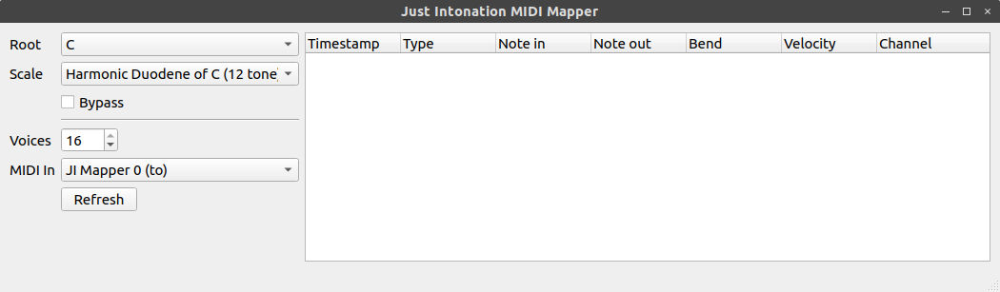

# Just Intonation MIDI Mapper #

JIMM maps incoming MIDI to just-intoned scales. It has a virtual MIDI port which you can connect to from a software MIDI source. JIMM's output is multi-channel, using one MIDI channel per active note up to 16 channels (it is 16 voice polyphonic). Each active note is sent to its own channel to keep the pitch-bend messages - used to tune the input - separate between active notes.

JIMM maps to scales that are 12 divisions of the octave only.

JIMM doesn't follow the MPE standard. The MPE standard allows for single-channel polyphony, which would break JIMM's tuning system.

JIMM uses my own Just-Intonation library [jintonic](https://github.com/inegm/jintonic), as well as [mido](https://github.com/mido/mido), and [PyQt5](https://www.riverbankcomputing.com/software/pyqt/intro). It requires Python 3.6+.

## Using JIMM ##

Set-up a virtual environment by typing (in jimm's root directory):

`virtualenv venv -p python3`

Launch the virtual environment:

`source venv/bin/activate`

Install the requirements:

`pip install -r requirements.txt`

Launch JIMM by typing :

`python jimm.py`

You should see something like this :

You can set a scale root, select a scale, and bypass the mapper with the top-left form.

You can set the maximum number of voices and select your MIDI input device with the bottom-left form. The `JI Mapper n (to)` option is JIMM's virtual input port.

The tree-view on the right will print all incoming and mapped MIDI messages.

In your sampler (or wherever you're sending the mapped messages), create as many MIDI tracks as you've chosen to have voices, all on the `JI Mapper n (from)` MIDI port, and assign each track to its own channel.

## This version ##

This is a minimum-viable-product release, not even an alpha. There's no means to add scales, the tree-view is only really useful for troubleshooting, there is no analytical view of the tones played. There's more to come.
